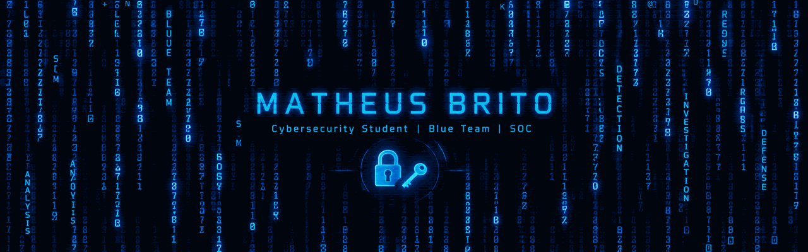

  

🔐 Cybersecurity Student

Blue Team • SOC • Defensive Security

I'm a Cybersecurity undergraduate at PUCPR, currently focused on developing my knowledge and practical skills in Blue Team and Security Operations Center (SOC) activities.

My main interests include:

🔵 Blue Team & SOC Operations
🔎 Vulnerability Analysis & CVEs
📊 Security Monitoring & Log Analysis
🚨 Incident Response
🤖 Security Automation
🌐 Network & Web Security

I use this GitHub to document my studies, experiments, projects and progress throughout my cybersecurity journey.

┌──────────────────────────────────────────────────────────────┐
│                                                              │
│   🔵 BLUE TEAM                                                │
│                                                              │
│   DETECT  →  INVESTIGATE  →  RESPOND  →  IMPROVE             │
│                                                              │
└──────────────────────────────────────────────────────────────┘

🔵 Blue Team Focus

I'm currently developing my knowledge in defensive cybersecurity:

Area	Focus
🔵 Blue Team	Defensive Security & SOC
📊 Monitoring	Logs, Events & Security Monitoring
🔎 Detection	Threat Detection & IOC Analysis
🚨 Response	Incident Response & Investigation
🛡️ Vulnerabilities	CVEs & Vulnerability Analysis
🤖 Automation	Security Scripts & Tools
🌐 Networking	Network Fundamentals & Analysis
🛠️ Technologies & Skills
💻 Programming Languages

    

🌐 Web Development

    

🗄️ Database

  

⚛️ Quantum Computing

  

🔧 Tools & Environments

     

🧪 Cybersecurity Labs

My cybersecurity studies are focused on understanding defensive security through practical experimentation.

Cybersecurity
│
├── 🔵 Blue Team
│   ├── SOC
│   ├── Security Monitoring
│   ├── Log Analysis
│   └── Threat Detection
│
├── 🔎 Vulnerability Analysis
│   └── CVEs
│
├── 🌐 Network Security
│
├── 🛡️ Defensive Security
│
└── 🤖 Security Automation

🚀 Projects

My repositories are organized around different areas of my technical development.

Category	Focus
🔵 Blue Team	SOC, monitoring, detection & investigation
🛡️ Cybersecurity	Security studies, labs & experiments
🐍 Python	Programming & security automation
🦀 Rust	Systems programming & experiments
🌐 Web	HTML, CSS, JavaScript & Web Security
🗄️ MySQL	Databases, SQL & data modeling
⚛️ Qiskit	Quantum computing & experiments
📚 Education
🎓 Pontifícia Universidade Católica do Paraná — PUCPR

Cybersecurity

Undergraduate Student

🏅 Certifications & Courses
Cisco Networking Academy

✅ Introduction to Cybersecurity — Completed
✅ Introduction to Packet Tracer — Completed
📖 Currently Learning
🔵 BLUE TEAM
      │
      ├── 📊 SOC & Security Monitoring
      │
      ├── 🔎 Threat Detection
      │
      ├── 🚨 Incident Response
      │
      ├── 🛡️ Vulnerability Analysis
      │
      └── 🤖 Security Automation

Alongside cybersecurity, I'm continuously improving my knowledge of programming, networking, databases and systems.

⚛️ Beyond Cybersecurity

I'm also interested in Quantum Computing and currently exploring Qiskit, quantum circuits and quantum algorithms.

This is an area I study alongside cybersecurity to understand emerging technologies and their potential impact on computing and security.

📊 GitHub Statistics

   

📡 System Status
┌──────────────────────────────────────────────────────────────┐
│  STATUS                                                       │
│                                                              │
│  [████████████████████░░]  LEARNING                          │
│                                                              │
│  Focus        : Blue Team / SOC                              │
│  Environment  : Cybersecurity                                │
│  Mode         : Continuous Learning                          │
│                                                              │
│  > Monitoring...                                              │
│  > Investigating...                                           │
│  > Improving...                                               │
└──────────────────────────────────────────────────────────────┘

🔵 DETECT • INVESTIGATE • RESPOND • DEFEND

 
  

