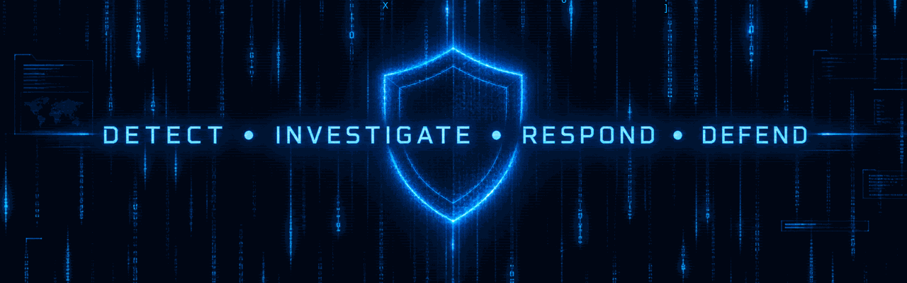

<div align="center">  </div>

<br>

# 🔐 Cybersecurity Student  |  Blue Team • SOC • Defensive Security

I'm a Cybersecurity undergraduate at PUCPR, currently focused on developing my knowledge and practical skills in Blue Team and Security Operations Center (SOC) activities.

My main interests include:

- 🔵 Blue Team & SOC Operations
  
- 🔎 Vulnerability Analysis & CVEs
  
- 📊 Security Monitoring & Log Analysis
  
- 🚨 Incident Response
  
- 🤖 Security Automation
  
- 🌐 Network & Web Security

I use this GitHub to document my studies, experiments, projects and progress throughout my cybersecurity journey.

<br>

```
┌──────────────────────────────────────────────────────────────┐
│                                                              │
│ 🔵 BLUE TEAM                                                 │
│                                                              │
│   DETECT  →  INVESTIGATE  →  RESPOND  →  IMPROVE             │
│                                                              │
└──────────────────────────────────────────────────────────────┘
```
<br>

# 🔵 Blue Team Focus

I'm currently developing my knowledge in defensive cybersecurity:


- 🔵 Blue Team	Defensive Security & SOC
  
- 📊 Monitoring	Logs, Events & Security Monitoring
  
- 🔎 Detection	Threat Detection & IOC Analysis
  
- 🚨 Response	Incident Response & Investigation
  
- 🛡️ Vulnerabilities	CVEs & Vulnerability Analysis
  
- 🤖 Automation	Security Scripts & Tools
  
- 🌐 Networking	Network Fundamentals & Analysis

<br>
<br>

# 🛠️ Technologies & Skills

| Area | Languages & Technologies |
| --- | --- |
| 💻 Programming Languages |   |
| 🌐 Web Development |    |
| 🗄️ Database |  |
| ⚛️ Quantum Computing |  |
| 🔧 Tools & Environments |        |


## 🧪 Cybersecurity Labs

My cybersecurity studies are focused on understanding defensive security through practical experimentation.

```
Cybersecurity
│
├── 🔵 Blue Team
│   ├── SOC
│   ├── Security Monitoring
│   ├── Log Analysis
│   └── Threat Detection
│
├── 🔎 Vulnerability Analysis
│   └── CVEs
│
├── 🌐 Network Security
│
├── 🛡️ Defensive Security
│
└── 🤖 Security Automation
```

# 🚀 Projects

My repositories are organized around different areas of my technical development.

## Category Focus:

- 🔵 Blue Team	SOC, monitoring, detection & investigation
- 🛡️ Cybersecurity	Security studies, labs & experiments
- 🐍 Python	Programming & security automation
- 🦀 Rust	Systems programming & experiments
- 🌐 Web	HTML, CSS, JavaScript & Web Security
- 🗄️ MySQL	Databases, SQL & data modeling
- ⚛️ Qiskit	Quantum computing & experiments

<br>

# 📚 Education

| 🎓 Institution | 📖 Course | 📅 Status |
|---|---|---|
| Pontifícia Universidade Católica do Paraná —  |  |  |  |  |
| Pontifícia Universidade Católica do Paraná —  |  |  |

<br>

# 🏅 Certifications & Courses

| 🏅 Certifications | 📅 Status | 🎓 Institution |
| --- | --- | --- |
|  |  |  |
|  |  |  |
|  |  |  |
|  |  |  |

<br>

# 📖 Currently Learning

```
🔵 BLUE TEAM
      │
      ├── 📊 SOC & Security Monitoring
      │
      ├── 🔎 Threat Detection
      │
      ├── 🚨 Incident Response
      │
      ├── 🛡️ Vulnerability Analysis
      │
      └── 🤖 Security Automation
```
<br>

Alongside cybersecurity, I'm continuously improving my knowledge of programming, networking, databases and systems.

<br>

## ⚛️ Beyond Cybersecurity

I'm also interested in Quantum Computing and currently exploring Qiskit, quantum circuits and quantum algorithms.

This is an area I study alongside cybersecurity to understand emerging technologies and their potential impact on computing and security.

<br>

### 📊 GitHub Statistics

<picture align="center">
  <source media="(prefers-color-scheme: dark)" srcset="https://raw.githubusercontent.com/MathBrito0/MathBrito0/output/github-contribution-grid-snake-dark.svg">
  <source media="(prefers-color-scheme: light)" srcset="https://raw.githubusercontent.com/MathBrito0/MathBrito0/output/github-contribution-grid-snake-dark.svg">
  
</picture>

<div display="flex">

<div align="center">
  
</div>


## 📡 System Status



<br>

<div align="center">

</div>
